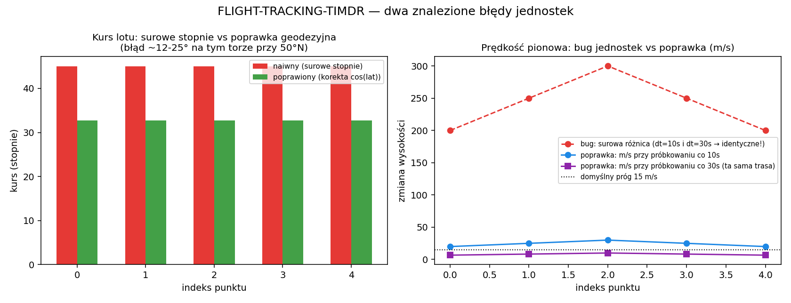

# FLIGHT-TRACKING-TIMDR

Moduł analizy toru lotu (`timdr_flight.py`): gradient ruchu (TIMDR-flow),
detekcja nagłych zmian kursu i wysokości (twist), redukcja szumu toru
(TRM) i prosta predykcja trajektorii. Rozwinięcie `TIMDR-Radar-Module`
pod dane `[lat, lon, alt, t]`.

## Status

Kod ze zgłoszenia uruchomiony i przetestowany (`test_timdr_flight.py`,
11/11 testów przechodzi). Znalezione i naprawione: dwa błędy dziedziczone
z `TIMDR-Radar-Module` (zawijanie kąta, gradient po indeksie zamiast po
czasie) oraz dwa nowe błędy specyficzne dla danych geograficznych.



### 🐛 Błąd 1: kurs liczony z surowych stopni lat/lon (bez korekty cos(lat))

1 stopień długości geograficznej odpowiada ok. 111.32 km × cos(szerokość)
na powierzchni Ziemi — czyli **maleje** wraz ze wzrostem szerokości
geograficznej. Oryginalny kod liczył `arctan2` bezpośrednio na różnicach
stopni `[lat, lon]`, traktując 1° lat i 1° lon jako tę samą odległość.

Zweryfikowano na torze ze zgłoszenia (ok. 50°N): naiwny kurs z surowych
stopni dawał **45.0°**, podczas gdy prawdziwy kurs (po korekcie
`cos(lat)`) to **57.29°** — błąd 12.3°. Im bliżej biegunów, tym błąd
większy; przy 70°N ten sam tor dawałby jeszcze większe zniekształcenie.
Naprawiono przez rzutowanie `lat/lon` na lokalną płaszczyznę styczną w
metrach (`_project_local_xy`) przed liczeniem kierunku ruchu.

### 🐛 Błąd 2: zawijanie kąta w `twist()` (ten sam bug co w TIMDR-Radar-Module)

Kurs bliski 180°/-180° (lot na południe) powoduje, że `arctan2`
przeskakuje między wartościami blisko +π i -π. Zweryfikowano: lot na
południe z rzeczywistym wahnięciem kursu ~0.1-0.6° na krok dawał **4
fałszywe alarmy „twist" na 5 punktów** przy naiwnym `np.gradient()` na
kątach; **0 fałszywych alarmów** po zastosowaniu `np.unwrap()` przed
różniczkowaniem. Test regresyjny:
`test_lot_na_poludnie_bez_falszywego_twistu`.

### 🐛 Błąd 3: próg wysokości liczony na indeksie próbki, nie na czasie

`np.gradient(alt)` bez przekazania `t` liczy surową różnicę wysokości
**między próbkami**, nie prędkość pionową. Zweryfikowano: dla identycznej
fizycznej dynamiki lotu (ta sama trasa wysokości) próbkowana co 10s i co
30s, surowa różnica dawała **te same liczby** (200-300) niezależnie od
odstępu czasowego, mimo że rzeczywista prędkość pionowa różniła się
3-krotnie (20-30 m/s vs 6.7-10 m/s). Oznacza to, że próg `alt_thresh=50`
oznaczał różne rzeczy w zależności od częstotliwości nadawania ADS-B/MLAT
— bezużyteczne dla realnych, nierównomiernie próbkowanych danych.
Naprawiono: `climb_rate = np.gradient(alt, t)`, próg teraz w m/s
(domyślnie 15 m/s ≈ 2950 ft/min, jawnie udokumentowany jako wartość do
dostrojenia per typ statku powietrznego, nie zwalidowana norma ATC).

### 🐛 Błąd 4 (dziedziczony): `timdr_flow()` mieszał gradient po czasie z gradientem po indeksie

Tak jak w `TIMDR-Radar-Module`: ostatni krok (`flow = np.gradient(v + a,
axis=0)`) nie używał `t`, niespójnie z `v` i `a`. Dodatkowo w wersji
lotniczej ten sam wektor `flow` mieszał stopnie (lat/lon, skala ~10⁻³) z
metrami (alt, skala ~10⁰) — wartości fizycznie nieporównywalne w jednym
wektorze. Naprawiono: `flow` liczony w spójnych jednostkach metrycznych
(lokalna płaszczyzna styczna + wysokość), względem rzeczywistego `t`.

### Uwaga o danych przykładowych

Diagnostyka (`diagnostics()`) na torze ze zgłoszenia pokazuje prędkość
względem ziemi rosnącą do **~1000 węzłów** i wznoszenie **~4000-6000
ft/min** — to fizycznie nierealne dla typowego lotu komercyjnego (przykład
w zgłoszeniu ma przyspieszające, coraz większe skoki lat/lon). To nie
błąd kodu, tylko efekt przykładowych danych — ale dobrze ilustruje, po co
`diagnostics()` jest przydatne: pozwala od razu wychwycić fizycznie
niewiarygodny tor (błąd sensora, zgubiona ramka ADS-B, sklejenie dwóch
różnych lotów).

## 🎯 Zastosowania (i warunki, przy których mają sens)

**1. Monitoring toru lotu / wsparcie ATC (wykrywanie anomalii)**
`twist()` jako flaga "coś nietypowego": gwałtowna zmiana kursu lub
prędkości pionowej.
*Warunki:* dane muszą mieć realny znacznik czasu (nie numer wiadomości);
próg `climb_rate_thresh_mps` i `angle_thresh` trzeba dostroić do typu
ruchu lotniczego (samolot pasażerski ≠ myśliwiec ≠ dron) — domyślne
wartości to punkt startowy, nie norma. To narzędzie do przesiewania
(flagowania do przeglądu przez człowieka), nie certyfikowany system
detekcji anomalii ATC.

**2. Analiza historycznych tras (post-flight, offline)**
`trm_reduce()` + `diagnostics()` do oczyszczenia i podsumowania toru z
logu ADS-B/FDR.
*Warunki:* dane wsadowe (batch), nie strumień na żywo — `twist()` i
`timdr_flow()` używają różnicy centralnej (`np.gradient`), czyli
wykrycie zdarzenia w punkcie *i* korzysta też z punktu *i+1* (informacja
z przyszłości względem *i*). Do przetwarzania na żywo nadaje się to
tylko z jednopróbkowym opóźnieniem.

**3. Wychwytywanie błędnych/niespójnych danych telemetrycznych**
`diagnostics()` (prędkość względem ziemi w węzłach, prędkość pionowa w
ft/min) jako szybki sanity-check — wartości fizycznie niemożliwe
(>700kt dla samolotu pasażerskiego, >10000 ft/min) sygnalizują błąd
danych, nie manewr.
*Warunki:* przydatne tylko jeśli znasz z grubsza typ statku powietrznego
(inne granice "sensowności" dla samolotu pasażerskiego, śmigłowca,
drona).

**4. Krótkoterminowa predykcja pozycji (`predict()`)**
*Warunki:* ekstrapolacja kinematyczna z lokalnie stałym przyspieszeniem
— wiarygodna na bardzo krótkim horyzoncie (sekundy-dziesiątki sekund) i
tylko dla lotu bez manewru w tym oknie. Nie modeluje planu lotu, wiatru
ani intencji pilota. Nie używać jako jedynego źródła do separacji ruchu
lotniczego.

### Ograniczenia geodezyjne (dotyczą wszystkich zastosowań)

- Rzutowanie na lokalną płaszczyznę styczną (equirectangular) jest
  dobrym przybliżeniem dla torów **regionalnych** (rzędu do kilkuset
  km). Dla lotów długodystansowych/transoceanicznych błąd rośnie —
  lepiej dzielić trasę na segmenty albo użyć właściwej biblioteki
  geodezyjnej (np. `pyproj`).
- Tor przecinający południk 180° (antimeridian) **nie jest obsługiwany**
  — `_validate()` rzuci wyjątek zamiast cicho zwrócić błędny wynik.
- `predict()` i `trm_reduce()` operują na lat/lon w stopniach — dla nich
  poprawka `cos(lat)` matematycznie nie zmienia wyniku w stopniach
  (skalowanie liniowe znosi się przy odwrotnym rzutowaniu), więc nie
  oczekuj innych wartości niż w wersji bez poprawki. Poprawka ma
  znaczenie tam, gdzie liczony jest **kierunek/kąt** (`twist()`,
  `diagnostics()`) — tam faktycznie zmienia wynik.

### Przykład użycia (identyczny jak w zgłoszeniu, plus diagnostics)

```python
from timdr_flight import TIMDRFlight

timdr = TIMDRFlight()
track = [
    [50.0, 19.9, 1000, 0],
    [50.01, 19.91, 1200, 10],
    [50.03, 19.93, 1500, 20],
    [50.06, 19.96, 1800, 30],
    [50.10, 20.00, 2000, 40],
]

flow = timdr.timdr_flow(track)
twist = timdr.twist(track)
stable = timdr.trm_reduce(track)
pred = timdr.predict(track)
diag = timdr.diagnostics(track)
```

Uruchomienie: `python demo.py` / testy: `pytest -q`.
