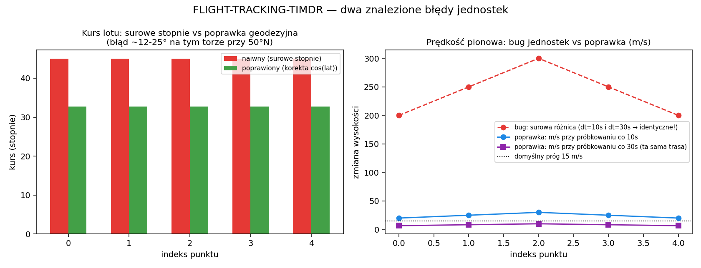

# FLIGHT-TRACKING-TIMDR

Moduł analizy toru lotu (`timdr_flight.py`): gradient ruchu (TIMDR-flow),
detekcja nagłych zmian kursu i wysokości (twist), redukcja szumu toru
(TRM) i prosta predykcja trajektorii. Rozwinięcie `TIMDR-Radar-Module`
pod dane `[lat, lon, alt, t]`.

## Status

Kod ze zgłoszenia uruchomiony i przetestowany (`test_timdr_flight.py` +
`test_frenet_serret.py` + `test_conflict_alert.py` +
`test_conflict_fleet_airspace.py`, 27/27 testów przechodzi). Znalezione i
naprawione: dwa błędy dziedziczone z `TIMDR-Radar-Module` (zawijanie
kąta, gradient po indeksie zamiast po czasie) oraz dwa nowe błędy
specyficzne dla danych geograficznych. Dodano też torsję 3D
(`frenet_serret`/`twist_3d`) — patrz sekcja niżej. Zależności: `numpy`,
`scipy` (Savitzky-Golay w `frenet_serret`).



### 🐛 Błąd 1: kurs liczony z surowych stopni lat/lon (bez korekty cos(lat))

1 stopień długości geograficznej odpowiada ok. 111.32 km × cos(szerokość)
na powierzchni Ziemi — czyli **maleje** wraz ze wzrostem szerokości
geograficznej. Oryginalny kod liczył `arctan2` bezpośrednio na różnicach
stopni `[lat, lon]`, traktując 1° lat i 1° lon jako tę samą odległość.

Zweryfikowano na torze ze zgłoszenia (ok. 50°N): naiwny kurs z surowych
stopni dawał **45.0°**, podczas gdy prawdziwy kurs (po korekcie
`cos(lat)`) to **57.29°** — błąd 12.3°. Im bliżej biegunów, tym błąd
większy; przy 70°N ten sam tor dawałby jeszcze większe zniekształcenie.
Naprawiono przez rzutowanie `lat/lon` na lokalną płaszczyznę styczną w
metrach (`_project_local_xy`) przed liczeniem kierunku ruchu.

### 🐛 Błąd 2: zawijanie kąta w `twist()` (ten sam bug co w TIMDR-Radar-Module)

Kurs bliski 180°/-180° (lot na południe) powoduje, że `arctan2`
przeskakuje między wartościami blisko +π i -π. Zweryfikowano: lot na
południe z rzeczywistym wahnięciem kursu ~0.1-0.6° na krok dawał **4
fałszywe alarmy „twist" na 5 punktów** przy naiwnym `np.gradient()` na
kątach; **0 fałszywych alarmów** po zastosowaniu `np.unwrap()` przed
różniczkowaniem. Test regresyjny:
`test_lot_na_poludnie_bez_falszywego_twistu`.

### 🐛 Błąd 3: próg wysokości liczony na indeksie próbki, nie na czasie

`np.gradient(alt)` bez przekazania `t` liczy surową różnicę wysokości
**między próbkami**, nie prędkość pionową. Zweryfikowano: dla identycznej
fizycznej dynamiki lotu (ta sama trasa wysokości) próbkowana co 10s i co
30s, surowa różnica dawała **te same liczby** (200-300) niezależnie od
odstępu czasowego, mimo że rzeczywista prędkość pionowa różniła się
3-krotnie (20-30 m/s vs 6.7-10 m/s). Oznacza to, że próg `alt_thresh=50`
oznaczał różne rzeczy w zależności od częstotliwości nadawania ADS-B/MLAT
— bezużyteczne dla realnych, nierównomiernie próbkowanych danych.
Naprawiono: `climb_rate = np.gradient(alt, t)`, próg teraz w m/s
(domyślnie 15 m/s ≈ 2950 ft/min, jawnie udokumentowany jako wartość do
dostrojenia per typ statku powietrznego, nie zwalidowana norma ATC).

### 🐛 Błąd 4 (dziedziczony): `timdr_flow()` mieszał gradient po czasie z gradientem po indeksie

Tak jak w `TIMDR-Radar-Module`: ostatni krok (`flow = np.gradient(v + a,
axis=0)`) nie używał `t`, niespójnie z `v` i `a`. Dodatkowo w wersji
lotniczej ten sam wektor `flow` mieszał stopnie (lat/lon, skala ~10⁻³) z
metrami (alt, skala ~10⁰) — wartości fizycznie nieporównywalne w jednym
wektorze. Naprawiono: `flow` liczony w spójnych jednostkach metrycznych
(lokalna płaszczyzna styczna + wysokość), względem rzeczywistego `t`.

### Nowość: torsja 3D trajektorii (`frenet_serret` / `twist_3d`)

Krzywizna `kappa(t)` i torsja (skręcenie) `tau(t)` liczone standardowymi
wzorami Freneta-Serreta (`kappa = |r'×r''|/|r'|³`, `tau = ((r'×r'')·r''')/|r'×r''|²`)
z prawdziwej trajektorii 3D (wschód/północ/wysokość w metrach). `tau` to
dokładnie ta sama wielkość matematyczna co "skręcenie" znane z klasycznej
geometrii różniczkowej — nie jest to przybliżenie ani metafora zapożyczona
z innej dziedziny.

**Zweryfikowane na znanej analitycznie helisie** (`test_frenet_serret_helisa_kappa_tau_dokladne`):
błąd względny kappa i tau < 5% na czystych danych, przechodząc przez pełny
pipeline geo-projekcji (lat/lon → lokalna płaszczyzna styczna), nie tylko
na surowych współrzędnych.

**Uczciwie zmierzone ograniczenie**: tau wymaga trzeciej pochodnej
pozycji (jerk). Surowe trzykrotne różnicowanie (`np.gradient` x3, tak jak
reszta modułu liczy `flow`) wzmacnia szum pomiarowy GPS/ADS-B **10-40×**
— przy szumie 0.5m odchylenie std. samego tau wyszło ok. **2.6** dla
sygnału o prawdziwej wartości ~0.065, czyli praktycznie bezużyteczne.
Naprawiono wygładzaniem Savitzky-Golay z oknem dobieranym **w sekundach**
(nie w liczbie próbek — inaczej ta sama fizyczna dynamika dawałaby różne
wyniki przy różnej częstotliwości próbkowania, dokładnie ten sam błąd co
już poprawiony wcześniej w `twist()`). Nawet po wygładzeniu tau pozostaje
najbardziej szumną wielkością w tym module — traktuj pojedyncze wartości
jako orientacyjne.

`twist_3d()` flaguje punkty, gdzie tau mocno odstaje od własnej historii
toru (próg adaptacyjny z rozstępu p10-p90, ten sam wzorzec co reszta
ekosystemu TIMDR — zob. skill `timdr-signal-framework` §2). Sprawdzone na
danych syntetycznych: łagodny, stały zakręt nie generuje żadnych
alarmów; wstrzyknięty gwałtowny manewr (oscylacja pionowa nałożona na
kontynuację zakrętu) zostaje wykryty, a flagi skupiają się w oknie
manewru, nie rozrzucone losowo po całym locie.

**Czego NIE zweryfikowano**: to narzędzie nie było testowane na
prawdziwych danych ADS-B/FDR, tylko na syntetycznych trajektoriach.
Traktuj jako prototyp do dalszej walidacji na realnym ruchu lotniczym,
nie jako gotowy detektor manewrów.

#### Naprawa: maskowanie progu w `twist_3d()` (Pattern B)

Znalezione przy audycie całego ekosystemu TIMDR pod kątem progów
liczonych z tej samej (potencjalnie małej) próbki, którą się testuje —
patrz `GIA-TIMDR/docs/geometry/TIMDR_Trefoil_MissingCoordinateSolver.md`
dla pełnego opisu mechanizmu maskowania. Stary kod liczył
medianę/p10/p90 z CAŁEGO `tau`, włącznie z testowanym punktem — duży,
realny outlier mógł zawyżać własny próg wykrywania. Naprawiono:
`twist_3d(robust_loo=True)` (domyślne) liczy próg dla każdego punktu z
pominięciem tego punktu (leave-one-out); `robust_loo=False` odtwarza
stare zachowanie.

**Uczciwy wynik pomiaru tej naprawy**: na torze typowej długości
(~170 punktów) z manewrem zajmującym ~7% toru, wykrywalność była już
solidna w SZEROKIM zakresie amplitud (50-1600) NIEZALEŻNIE od
`robust_loo` — maskowanie NIE jest tu dominującym problemem przy
typowym rozmiarze próbki (w przeciwieństwie do wcześniej znalezionego
przypadku N~25 w GIA-TIMDR, gdzie mean±std na małej próbce dawało
recall bliski przypadkowi). Naprawa jest tanim, bezpiecznym
usprawnieniem (nie psuje istniejącej wykrywalności — test
`test_detection_robust_across_amplitude_range_on_typical_length_track`),
ale nie jest tym, co dominuje realne ograniczenia tego narzędzia —
patrz niżej.

#### Uczciwe ograniczenie: okno wygładzania a krótkie manewry

Przy testowaniu naprawy maskowania znaleziono WAŻNIEJSZE ograniczenie:
na BARDZO KRÓTKICH torach (~15-25 punktów) z KRÓTKIMI manewrami
(1-3 punkty), `twist_3d()` daje CAŁKOWITY brak detekcji NIEZALEŻNIE OD
AMPLITUDY (sprawdzone do +3200m — dziesiątki razy większej niż
amplitudy, które są wykrywane na dłuższych torach). Przyczyna: okno
wygładzania (`window_seconds`), potrzebne żeby zwalczyć wzmacnianie
szumu (patrz sekcja wyżej), musi być szersze niż pojedynczy punkt, żeby
dać stabilną pochodną 3. rzędu — ale gdy jest SZERSZE niż sam manewr,
wygładza go razem z sąsiednim, spokojnym lotem, znosząc dokładnie ten
sygnał, który ma wykryć. To jest bezpośredni kompromis wynikający z
naprawy wzmacniania szumu (patrz też analogiczna naprawa w
`THE_TIMDR_Hyperflow_Engine`) — im lepiej tłumisz szum wygładzaniem, tym
łatwiej przypadkiem stłumić też krótkotrwałą, realną anomalię. NIE
naprawione tutaj (wymagałoby adaptacyjnego doboru okna do nieznanej z
góry długości manewru) — udokumentowane i pokryte testem
(`test_short_maneuver_on_short_track_undetected_regardless_of_amplitude`
w `test_twist_3d_masking_and_window_limits.py`), żeby przyszła zmiana
nie zepsuła cicho tej wiedzy.

### Conflict alert (`conflict_alert`) — przewidywana separacja dwóch torów

Rozszerzenie inspirowane porównaniem z realnym STCA (Short-Term Conflict
Alert) używanym w kontroli ruchu lotniczego. Bierze dwa tory, przewiduje
ich ruch naprzód tym samym modelem kinematycznym co `predict()`
(lokalnie stałe przyspieszenie), i sprawdza, czy w oknie czasowym istnieje
moment, w którym separacja pozioma I pionowa jednocześnie spadają poniżej
progu.

Domyślne progi (**5 NM poziomo, 1000 ft pionowo**) to prawdziwe minima
separacji ICAO dla kontrolowanej przestrzeni en-route (RVSM) — sprawdzone
źródłowo, nie zmyślone. Domyślny horyzont 120s odpowiada typowemu
horyzontowi patrzenia realnego STCA (dalej liniowa/kinematyczna predykcja
przestaje być wiarygodna — to samo ograniczenie ma już `predict()`).

**Realny błąd znaleziony i naprawiony własnym testem**: pierwsza wersja
używała `_project_local_xy()` (tej samej co reszta modułu) do rzutowania
obu torów na płaszczyznę metryczną — ale ta funkcja liczy origin
względem **pierwszego punktu KAŻDEGO toru z osobna** (`lon[0]`/`lat[0]`).
Dla dwóch różnych torów dawało to dwa różne, niewspółmierne układy
współrzędnych — odejmowanie pozycji nie miało fizycznego sensu.
Test na jednoznacznym scenariuszu (dwa samoloty lecące wprost na siebie)
złapał to jako brak wykrytego konfliktu tam, gdzie oczywiście powinien
wystąpić. Naprawiono: `_kinematic_state()` rzutuje oba tory na **jeden
wspólny** punkt odniesienia (średnia lat/lon obu torów).

**Presety przestrzeni powietrznej** (`airspace="en_route"|"tma"|"final_approach"`,
patrz `AIRSPACE_PRESETS`): wartości sprawdzone źródłowo (ICAO Doc 4444 /
ECAC) — en-route 5 NM, TMA 3 NM, final approach 2.5 NM, wszystkie 1000 ft
pionowo. Jawnie podane `horizontal_nm`/`vertical_ft` zawsze nadpisują
preset. To rozsądne wartości domyślne do analizy/demo, NIE oficjalnie
zatwierdzone minima dla konkretnej, realnej przestrzeni.

**`conflict_alert_fleet(tracks, ...)`**: `conflict_alert()` uruchomione
dla każdej pary torów naraz (skan O(n²), jak realny STCA sprawdza
wszystkie pary w monitorowanej przestrzeni, nie jedną z góry wybraną
parę). `tracks` to słownik `{etykieta: tor}` — wynik jednoznacznie
wskazuje, która para koliduje. Posortowane po pilności
(`time_to_conflict_s` rosnąco). Dla dużej liczby torów (setki+) O(n²)
byłoby wolne bez indeksowania przestrzennego — dla garstki torów
(prototyp/demo) nieistotne.

**Uczciwe ograniczenia (to NIE jest certyfikowany system bezpieczeństwa
ATC)**: brak modelowania planu lotu/przydzielonych poziomów/intencji
pilota, zakłada że oba tory reprezentują z grubsza ten sam moment "teraz"
(starszy tor jest doekstrapolowany do czasu nowszego tym samym modelem
kinematycznym, co dokłada swój błąd), skan floty O(n²) bez optymalizacji
przestrzennej.

Wizualizacja: `demo_conflict_map.py` rysuje 3 gotowe przykłady (kurs
kolizyjny/bezpieczna separacja pionowa/bezpieczny odstęp poziomy) na
mapie i zapisuje `conflict_alert_przyklady.png`. Uruchamiane automatycznie
przez `run.bat` (patrz niżej).

## Porównanie z realnymi systemami i kierunki rozwoju

### Jak to wypada na tle FlightRadar24/FlightAware i STCA

**Pozyskiwanie danych (FlightRadar24/FlightAware)**: nieporównywalne
wprost. Te systemy działają na ADS-B — pozycja z GPS transpondera,
dokładność rzędu pojedynczych metrów, aktualizacja co kilka sekund przy
gęstej sieci naziemnych stacji odbiorczych (FlightAware: ponad 1000
stacji w 70+ krajach). TIMDR nie ma własnego źródła danych — to
biblioteka analityczna, której trzeba dostarczyć tor jako gotową tablicę
punktów; dokładność zależy całkowicie od tego, co się do niej wrzuci.

**Predykcja krótkoterminowa (`predict`)**: realnie porównywalna z
najprostszą, najpowszechniejszą metodą używaną w STCA — filtrem liniowym
(dead reckoning) z horyzontem patrzenia ~2 minuty. `predict()` jest
odrobinę bardziej rozbudowany (lokalnie stałe przyspieszenie, nie tylko
stała prędkość), ale ten sam rząd wielkości sofistykacji i to samo
ograniczenie (zawodzi przy manewrze).

**Wykrywanie konfliktów (`conflict_alert`/`conflict_alert_fleet`)**:
robi tę samą kategorię zadania co STCA (przewidywana separacja par
torów, progi ICAO, skan wszystkich par we "flocie"), tą samą
fundamentalną metodą (liniowa/kinematyczna predykcja). To co odróżnia to
od realnego STCA nie jest brakującą funkcją do dopisania, tylko
brakującym kontekstem: STCA wie o planie lotu i zgodach kontrolera i
dzięki temu wycisza alarmy dla w pełni bezpiecznych, zaplanowanych
skrzyżowań kursów na różnych poziomach — TIMDR tego kontekstu nie ma i
nie może mieć bez zewnętrznego źródła danych o planach lotu.

**Wygładzanie/estymacja stanu**: `trm_reduce()` to średnia krocząca
3-punktowa. Realny STCA (i każdy poważny tracker) używa filtru Kalmana z
propagacją niepewności (macierze P/Q/R). To zostaje największą
architektoniczną luką — słabsza estymacja prędkości/przyspieszenia
wpływa na WSZYSTKO w tym module (`predict`, `twist`, `conflict_alert`,
`frenet_serret`), nie tylko na samo wygładzanie.

**Torsja 3D (`frenet_serret`/`twist_3d`)**: tu TIMDR robi coś, czego
komercyjne trackery w ogóle nie oferują (nie muszą — to nie ich zadanie),
bo liczy prawdziwą wielkość różniczkowo-geometryczną z trajektorii, nie
tylko wyświetla pozycję.

### Kierunki rozwoju

**Zalecane, dobry stosunek wysiłku do wartości:**
- Prawdziwy filtr Kalmana (macierze P/Q/R, jak w realnym STCA) zamiast
  `trm_reduce()`'s średniej 3-punktowej — poprawiłby jednocześnie
  `predict()`, `twist()`, `conflict_alert()` i `frenet_serret()`, bo
  wszystkie opierają się na tej samej estymacji prędkości/przyspieszenia.
  Większy nakład niż dotychczasowe zmiany, ale architektonicznie
  najbardziej wartościowy pojedynczy krok.
- Indeksowanie przestrzenne (np. KD-drzewo) dla `conflict_alert_fleet()`
  przy większej liczbie torów — ten sam problem O(n²) już raz
  rozwiązany w `TIMDR-Radar-Module`, dałoby się przenieść wprost.

**Świadomie odradzane (wymagają danych/infrastruktury, których ten
projekt nie ma i które zmieniłyby go w zupełnie inny rodzaj systemu):**
- Integracja z planem lotu / zgodami kontrolera — wymaga zewnętrznego
  źródła planów lotu, którego tu nie ma.
- Strumieniowanie danych na żywo — wymaga infrastruktury odbiorczej
  ADS-B (albo płatnego API), poza zakresem biblioteki analitycznej.

Krótko: TIMDR dobrze pokrywa najprostszą kategorię metod używanych w
realnych systemach (liniowa predykcja + progi separacji + wygładzanie),
i to pokrycie jest teraz szersze (cała flota, różne typy przestrzeni) niż
na początku. Nie zbliżył się i nie powinien udawać, że się zbliża, do
tego co czyni realne systemy bezpiecznymi operacyjnie: świadomości
kontekstu (plan lotu, zgody) i jakości estymacji stanu (prawdziwy filtr).

Źródła użytych liczb: [Flightradar24 — ADS-B](https://www.flightradar24.com/blog/ads-b/),
[Aerodata — porównanie trackerów](https://aerodata.ai/flightradar24-vs-flightaware-vs-ads-b-exchange-which-tracker-is-best/),
[Short-term conflict alert — Wikipedia](https://en.wikipedia.org/wiki/Short-term_conflict_alert),
[STCA — SKYbrary](https://skybrary.aero/articles/short-term-conflict-alert-stca),
[Separation Standards — SKYbrary](https://skybrary.aero/articles/separation-standards),
[EUROCONTROL — ECAC radar separation minima](https://www.eurocontrol.int/sites/default/files/publication/content/documents/nm/ecac_radar_sep_min.pdf).

### Uwaga o danych przykładowych

Diagnostyka (`diagnostics()`) na torze ze zgłoszenia pokazuje prędkość
względem ziemi rosnącą do **~1000 węzłów** i wznoszenie **~4000-6000
ft/min** — to fizycznie nierealne dla typowego lotu komercyjnego (przykład
w zgłoszeniu ma przyspieszające, coraz większe skoki lat/lon). To nie
błąd kodu, tylko efekt przykładowych danych — ale dobrze ilustruje, po co
`diagnostics()` jest przydatne: pozwala od razu wychwycić fizycznie
niewiarygodny tor (błąd sensora, zgubiona ramka ADS-B, sklejenie dwóch
różnych lotów).

## 🎯 Zastosowania (i warunki, przy których mają sens)

**1. Monitoring toru lotu / wsparcie ATC (wykrywanie anomalii)**
`twist()` jako flaga "coś nietypowego": gwałtowna zmiana kursu lub
prędkości pionowej.
*Warunki:* dane muszą mieć realny znacznik czasu (nie numer wiadomości);
próg `climb_rate_thresh_mps` i `angle_thresh` trzeba dostroić do typu
ruchu lotniczego (samolot pasażerski ≠ myśliwiec ≠ dron) — domyślne
wartości to punkt startowy, nie norma. To narzędzie do przesiewania
(flagowania do przeglądu przez człowieka), nie certyfikowany system
detekcji anomalii ATC.

**2. Analiza historycznych tras (post-flight, offline)**
`trm_reduce()` + `diagnostics()` do oczyszczenia i podsumowania toru z
logu ADS-B/FDR.
*Warunki:* dane wsadowe (batch), nie strumień na żywo — `twist()` i
`timdr_flow()` używają różnicy centralnej (`np.gradient`), czyli
wykrycie zdarzenia w punkcie *i* korzysta też z punktu *i+1* (informacja
z przyszłości względem *i*). Do przetwarzania na żywo nadaje się to
tylko z jednopróbkowym opóźnieniem.

**3. Wychwytywanie błędnych/niespójnych danych telemetrycznych**
`diagnostics()` (prędkość względem ziemi w węzłach, prędkość pionowa w
ft/min) jako szybki sanity-check — wartości fizycznie niemożliwe
(>700kt dla samolotu pasażerskiego, >10000 ft/min) sygnalizują błąd
danych, nie manewr.
*Warunki:* przydatne tylko jeśli znasz z grubsza typ statku powietrznego
(inne granice "sensowności" dla samolotu pasażerskiego, śmigłowca,
drona).

**4. Krótkoterminowa predykcja pozycji (`predict()`)**
*Warunki:* ekstrapolacja kinematyczna z lokalnie stałym przyspieszeniem
— wiarygodna na bardzo krótkim horyzoncie (sekundy-dziesiątki sekund) i
tylko dla lotu bez manewru w tym oknie. Nie modeluje planu lotu, wiatru
ani intencji pilota. Nie używać jako jedynego źródła do separacji ruchu
lotniczego.

### Ograniczenia geodezyjne (dotyczą wszystkich zastosowań)

- Rzutowanie na lokalną płaszczyznę styczną (equirectangular) jest
  dobrym przybliżeniem dla torów **regionalnych** (rzędu do kilkuset
  km). Dla lotów długodystansowych/transoceanicznych błąd rośnie —
  lepiej dzielić trasę na segmenty albo użyć właściwej biblioteki
  geodezyjnej (np. `pyproj`).
- Tor przecinający południk 180° (antimeridian) **nie jest obsługiwany**
  — `_validate()` rzuci wyjątek zamiast cicho zwrócić błędny wynik.
- `predict()` i `trm_reduce()` operują na lat/lon w stopniach — dla nich
  poprawka `cos(lat)` matematycznie nie zmienia wyniku w stopniach
  (skalowanie liniowe znosi się przy odwrotnym rzutowaniu), więc nie
  oczekuj innych wartości niż w wersji bez poprawki. Poprawka ma
  znaczenie tam, gdzie liczony jest **kierunek/kąt** (`twist()`,
  `diagnostics()`) — tam faktycznie zmienia wynik.

### Przykład użycia (identyczny jak w zgłoszeniu, plus diagnostics)

```python
from timdr_flight import TIMDRFlight

timdr = TIMDRFlight()
track = [
    [50.0, 19.9, 1000, 0],
    [50.01, 19.91, 1200, 10],
    [50.03, 19.93, 1500, 20],
    [50.06, 19.96, 1800, 30],
    [50.10, 20.00, 2000, 40],
]

flow = timdr.timdr_flow(track)
twist = timdr.twist(track)
stable = timdr.trm_reduce(track)
pred = timdr.predict(track)
diag = timdr.diagnostics(track)
```

Uruchomienie: `python demo.py` (podstawowe demo tekstowe) albo
`run.bat` (Windows — instaluje zależności, uruchamia testy, generuje i
otwiera mapę z 3 przykładami `conflict_alert()`). Testy: `pytest -q`.
